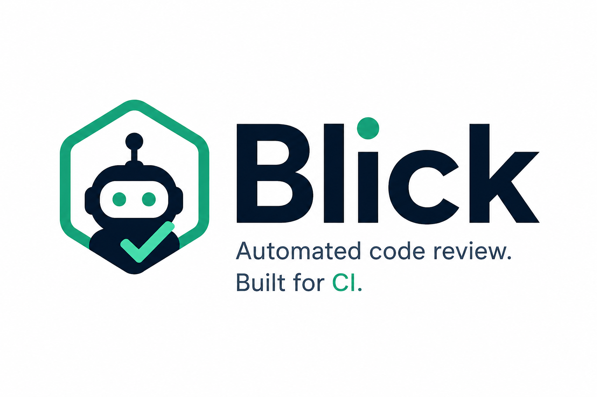

<br clear="left">

# blick

`blick` is a code review agent that drives the coding CLI you already use (`claude`, `codex`, or `opencode`) over your repository's diff, then publishes the findings as resolvable PR review comments and per-review check runs.

It's designed for monorepos: any subdirectory can declare its own `blick.toml` to define its own reviews, agent, and skills, and changes are routed to the nearest scope automatically.

---

## Table of contents

1. [Install](#-install)
2. [Quick start](#-quick-start)
3. [How it works](#-how-it-works)
4. [Configuration](#configuration)
5. [Skills](#-skills)
6. [Reviews](#reviews)
7. [Multi-scope monorepos](#multi-scope-monorepos)
8. [Agents](#-agents)
9. [Running reviews](#running-reviews)
10. [Rendering reports](#rendering-reports)
11. [GitHub Actions integration](#-github-actions-integration)
12. [Releases](#releases)
13. [Credits](#-credits)

---

## 🚀 Install

For local development in this repository:

```sh
mise install
```

To install the released CLI on any machine:

```sh
mise use -g github:tuist/blick
```

`blick` itself is just one binary. The agent CLI it drives (`claude`, `codex`, or `opencode`) needs to be on the `PATH`; install whichever one(s) you use the same way (most are available through `mise`, `npm`, or `brew`).

## ⚡ Quick start

```sh
# 1. Drop a starter config in the repo root.
blick init --agent opencode

# 2. Run a review against the diff between HEAD and origin/main.
blick review --base origin/main

# 3. (Optional) Render the run for downstream tools.
blick render --format=github-summary
```

The `init` command writes a minimal `blick.toml`. Everything below is what you can layer on top.

## 🔍 How it works

Every `blick review` invocation:

1. **Discovers scopes.** Walks the repo for every `blick.toml`. Each one defines a *scope* - the subtree it owns.
2. **Computes the diff** against the configured base (`HEAD` by default, or whatever you pass to `--base`).
3. **Partitions changed files by scope.** Each file is owned by the nearest `blick.toml` walking upward from the file.
4. **Runs reviews concurrently.** For every owning scope, every review defined there runs against the files in that scope. The agent CLI configured for that scope is invoked once per review.
5. **Persists per-task records** to `.blick/runs/<run-id>/` - one JSON record + one log file per `(scope, review)` pair, plus a `manifest.json` and a `latest` symlink.
6. **Combines findings** into a single report on stdout (or JSON with `--json`).

A separate `blick render` step transforms the persisted run into one of several downstream formats (PR review JSON, check-run JSON, markdown). Reviewing and rendering are decoupled so the same run can drive PR comments, status checks, Slack messages, and so on without re-invoking the agent.

## Configuration

A `blick.toml` has four blocks:

```toml
[agent]                        # which coding CLI to drive
kind = "opencode"
model = "anthropic/claude-sonnet-4-5"

[defaults]                     # run-level defaults
base = "origin/main"
max_diff_bytes = 120000
fail_on = "high"
max_concurrency = 4

[[skills]]                     # reusable analyses (referenced by reviews)
name = "owasp"
source = "tuist/blick-skills"

[[reviews]]                    # named bundles of skills + prompt
name = "security"
skills = ["owasp"]
fail_on = "high"
prompt = "Focus on injection, auth, and data exposure."
```

`agent` and `skills` cascade: a child `blick.toml` inherits them from its ancestor scopes. `reviews` are scope-local - each scope declares its own set, with no inheritance.

`blick config --explain` prints the effective configuration for every scope and which file each value came from.

## 🧩 Skills

A skill is a reusable analysis: a markdown body that describes what to look for, packaged in a directory with a `SKILL.md` (or `README.md`) file. Reviews reference skills by name to compose the agent's system prompt.

A skill source can be:

```toml
[[skills]]
name = "rust-idioms"
source = "./skills/rust-idioms"        # local directory, relative to this blick.toml

[[skills]]
name = "owasp"
source = "tuist/blick-skills"           # GitHub <owner>/<repo> shorthand
ref = "main"                            # optional: branch/tag/SHA
subpath = "skills/owasp"                # optional: read this dir within the repo
```

Remote skills are shallow-cloned into `~/.cache/blick/skills/<owner>/<repo>@<ref>/` on first use.

The skill markdown body becomes part of the agent's system prompt. Anything you'd put in a "checklist" or "review template" works - the more concrete and example-driven, the better the findings.

## Reviews

A review is a named bundle that composes one or more skills with an optional inline prompt:

```toml
[[reviews]]
name = "security"
skills = ["owasp", "secrets"]
fail_on = "high"
prompt = """
Pay special attention to user-controlled input flowing into shell commands.
"""
prompt_file = "docs/review/security.md"   # alternative to inline prompt
```

When `blick review security` runs, the agent receives:

- A base system prompt describing the review's job and required JSON output shape
- The body of every referenced skill, in order
- The inline `prompt` and/or contents of `prompt_file`
- A user prompt with the diff and changed files

`fail_on` controls the threshold at which a finding flips a check run to `failure` (defaults to `high`).

## Multi-scope monorepos

The presence of a `blick.toml` declares a scope. In a monorepo:

```
repo/
├── blick.toml                    # defaults for the whole repo
├── apps/
│   ├── web/blick.toml            # scopes apps/web/**
│   └── ios/blick.toml            # scopes apps/ios/**
└── libs/
    └── core/blick.toml           # scopes libs/core/**
```

When `blick review` runs:

- `apps/ios/AppDelegate.swift` is owned by `apps/ios/blick.toml`, runs the iOS-team reviews
- `apps/web/index.tsx` is owned by `apps/web/blick.toml`, runs the web-team reviews
- A change in `libs/core/src/lib.rs` is owned by `libs/core/blick.toml`

Each scope can declare its own `[agent]` (the iOS team uses `claude`, the web team uses `codex`) and add scope-specific `[[skills]]`, while inheriting common skills from the root.

```toml
# apps/ios/blick.toml
[agent]
kind = "claude"

[[skills]]
name = "swift-concurrency"
source = "./skills/swift-concurrency"

[[reviews]]
name = "technical"
skills = ["swift-concurrency"]
```

```toml
# apps/web/blick.toml
[agent]
kind = "codex"
model = "openai/gpt-5"

[[skills]]
name = "react-best-practices"
source = "vercel-labs/agent-skills"

[[reviews]]
name = "technical"
skills = ["react-best-practices"]
```

A PR touching both directories runs the iOS technical review with claude on the iOS files and the web technical review with codex on the web files, **concurrently** (subject to `max_concurrency`), each with its own scoped diff and its own check run on the PR.

## 🤖 Agents

Three agent kinds are supported:

| `kind`     | Backing CLI                       | Default model                  |
|------------|-----------------------------------|--------------------------------|
| `claude`   | [Claude Code](https://docs.anthropic.com/claude/docs/claude-code) | `anthropic/claude-sonnet-4-5` |
| `codex`    | [OpenAI Codex CLI](https://github.com/openai/codex) | `openai/gpt-5`                 |
| `opencode` | [opencode](https://opencode.ai)   | `anthropic/claude-sonnet-4-5` |

Models use the [models.dev](https://models.dev) `provider/model` syntax. `blick` strips the prefix when passing to adapters that don't accept it (Claude Code, Codex) and passes the full id verbatim to ones that do (opencode).

Override the binary or pass extra flags when needed:

```toml
[agent]
kind = "claude"
binary = "/opt/homebrew/bin/claude"
args = ["--dangerously-skip-permissions"]
```

The agent CLI is responsible for its own auth (`ANTHROPIC_API_KEY`, `OPENAI_API_KEY`, `opencode auth login`, etc.). `blick` does not store API keys.

### Overriding from the command line or environment

```sh
blick review --agent claude --model anthropic/claude-sonnet-4-5
BLICK_AGENT_KIND=opencode blick review
```

CLI flags > env vars > merged `blick.toml` cascade.

## Running reviews

```sh
# All reviews in scopes that own changed files
blick review

# A single named review (across all scopes that define it)
blick review security

# Different base
blick review --base origin/release/2.0

# Emit JSON (one combined report)
blick review --json

# Stream each task's stdout/stderr to stderr at completion
blick review --stream

# Override concurrency for this run
blick review --max-concurrency 8
```

While the run executes, blick prints `▶ scope/review starting…` markers to stderr at launch and `✓ scope/review done (N findings) - log: …` blocks as each task completes. The final combined report (or `--json` payload) is the only thing on stdout.

Each `(scope, review)` pair leaves four artifacts under `.blick/runs/<run-id>/`:

```
.blick/runs/20260427T112634Z/
├── manifest.json
├── apps_web--security.json       # structured task record (used by `blick render`)
├── apps_web--security.log        # captured stdout/stderr/text
├── apps_web--security.prompt.md  # the assembled system prompt (skills + overrides)
└── …
.blick/runs/latest -> 20260427T112634Z
```

The `.prompt.md` file is the exact system prompt blick built and sent to the agent for that task. It's the easiest way to confirm a skill is actually being applied (open the file and grep for the skill content) and to debug why a review came back the way it did.

## Rendering reports

`blick render` transforms a run into a downstream format. It does *not* re-invoke the agent - it reads the persisted records.

```sh
# Markdown summary, e.g. for `gh pr comment` or Slack
blick render --format=github-summary

# JSON for `POST /repos/{owner}/{repo}/pulls/{n}/reviews` - one resolvable
# review thread for the entire run, with a line comment per in-diff finding
blick render --format=github-review --head-sha=$SHA

# JSON Lines for `POST /repos/{owner}/{repo}/check-runs` - one Check Run per
# (scope, review), each with annotations on in-diff findings
blick render --format=check-run --head-sha=$SHA
```

Findings whose `(file, line)` is **outside** the PR's diff hunks (the agent commented on context it read) are surfaced in the review body or check-run summary instead of as inline comments. The GitHub API rejects out-of-diff comments; this filter keeps the API call safe.

`--run` selects which run to render (defaults to `latest`). `--head-sha` is required for `github-review` and `check-run` (in CI, pass the PR head commit).

## 🐙 GitHub Actions integration

`blick publish` reads the latest run from `.blick/runs/latest`, auto-detects the PR context from the GitHub Actions environment, and posts a Check Run per `(scope, review)` plus one resolvable PR review. See [`.github/workflows/blick-review.yml`](.github/workflows/blick-review.yml) for the canonical example. The full workflow is two steps:

```yaml
- name: Run blick review
  env:
    ANTHROPIC_API_KEY: ${{ secrets.ANTHROPIC_API_KEY }}
  run: blick review --base "origin/${{ github.event.pull_request.base.ref }}"

- name: Publish to the PR
  if: always()
  env:
    GH_TOKEN: ${{ secrets.GITHUB_TOKEN }}
  run: blick publish
```

Required permissions on the workflow: `checks: write`, `pull-requests: write`.

`blick publish` shells out to `gh api`, so the runner needs `gh` on PATH (it's pre-installed on GitHub-hosted runners). For non-Actions environments, pass `--head-sha`, `--gh-repo`, and `--pr` explicitly.

The PR author can mark each individual line comment as resolved as they fix it. That's standard GitHub PR review behavior, and works because we post through the reviews API rather than as plain issue comments or check annotations. Findings whose lines fall outside the PR's diff are surfaced in the review body so the API call doesn't 422.

It's also worth scoping the workflow to PRs from branches inside the repository (`if: github.event.pull_request.head.repo.full_name == github.repository`). Forked PRs don't have access to repo secrets and shouldn't be reviewed by an LLM agent that can read the codebase before the change is trusted.

## Releases

Releases are driven by conventional commits and `git-cliff`.

- `mise run release:detect` checks whether `main` contains releasable changes
- `mise run release:changelog` regenerates `CHANGELOG.md`
- [`.github/workflows/release.yml`](.github/workflows/release.yml) packages release archives and publishes GitHub releases that Mise can install through the `github:` backend

## 🙌 Credits

- [getsentry/warden](https://github.com/getsentry/warden) shaped the skills-driven review model and the per-PR comment UX
- [models.dev](https://models.dev) gave the cross-provider model identifier syntax
- [opencode](https://opencode.ai), [Claude Code](https://docs.anthropic.com/claude/docs/claude-code), and the [Codex CLI](https://github.com/openai/codex) are the agent CLIs `blick` drives
